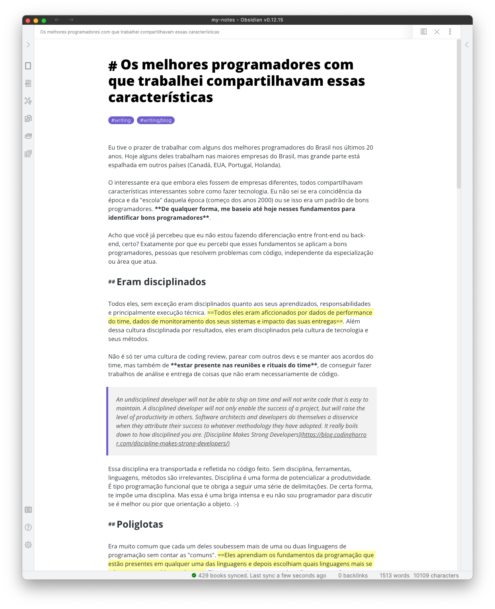

# Obsidian better editor typography
This is a CSS to make better the Obsidian editor typogaphy. 

## How to use
Just create a custom CSS Snippet in your Obsidian with this code and be happy.

**Disclaimer**: Since I created this CSS Snippet to improve my personal use, I created using the default theme of Obsidian. So, I don't know how this will work with another themes.

